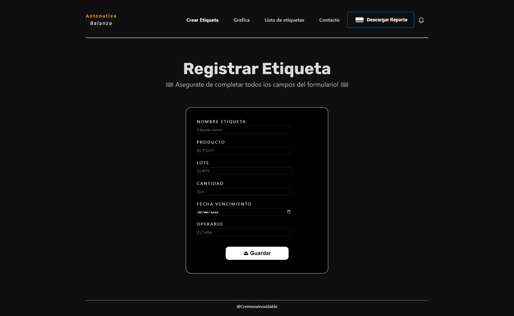

# Etiquetadora de Productos de Fiambres

_Este proyecto es una página web que te permite imprimir etiquetas adhesivas personalizadas para productos de fiambres. Además, cuenta con la funcionalidad de capturar el peso de un producto utilizando una balanza._

## Características principales

- Generación de etiquetas: _Puedes crear etiquetas adhesivas con los datos del producto, como el nombre, la descripción y el precio. Esto te permite tener etiquetas personalizadas y profesionales para tus productos de fiambres._
- Captura de peso:_La página web se integra con una balanza, lo que te permite capturar el peso del producto de forma precisa. Esta información se utiliza para mostrar el peso en la etiqueta y asegurar la exactitud de la información del producto._
- Interfaz intuitiva:_La interfaz de la página web es fácil de usar y está diseñada para que puedas generar etiquetas rápidamente. Solo necesitas ingresar los datos del producto y capturar el peso, y la página se encargará de generar la etiqueta de forma automática._

## Instrucciones de uso